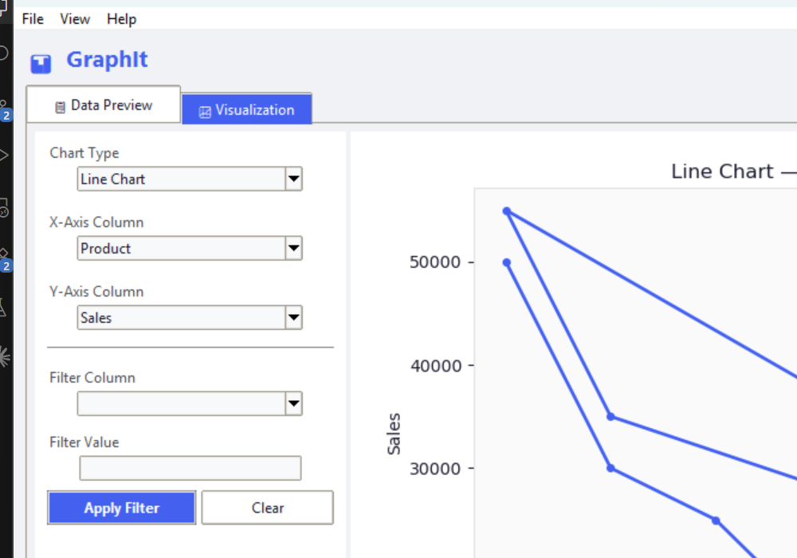
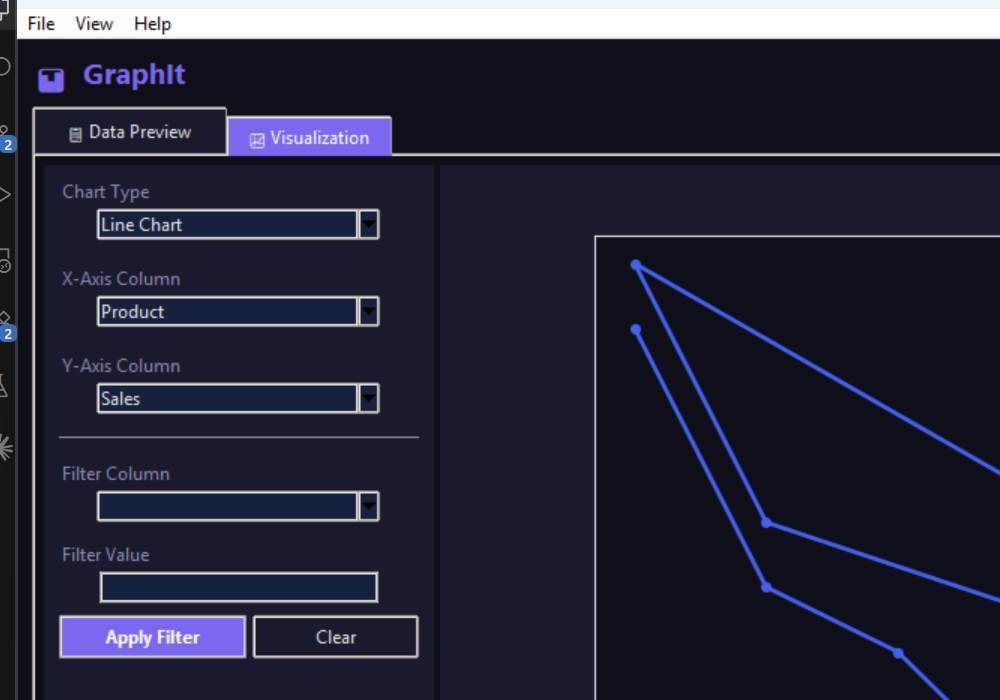

# 📊 GraphIt

GraphIt is a modern, feature-rich desktop data visualization application built using Python, Tkinter, Pandas, and Matplotlib. It allows users to quickly load datasets (CSV or Excel), preview and search data, apply filters, and generate interactive, high-quality plots with customizable light and dark themes.

---

## 📸 Screenshots

### Light Mode


### Dark Mode


---

## ✨ Features

- **📂 Multi-Format File Support**: Upload CSV and Excel (`.xlsx`) files with automatic column validation and error handling.
- **📋 Live Data Preview**: Browse the first 10 rows of your dataset in a scrollable data table.
- **📊 Interactive Matplotlib Canvas**: Pan, zoom, and explore charts directly inside the GUI.
- **🏷️ Smart Hover Tooltips**: Get detailed value info on hover utilizing `mplcursors` integration.
- **🔍 Column Search**: Quickly filter and search through datasets with numerous columns.
- **📐 Summary Statistics**: Access data types, missing value counts, and descriptive statistics in a single click.
- **⚙️ Column Filtering**: Apply numeric comparisons or string/partial matches on any column to slice the dataset.
- **🎨 6 Chart Types**:
  - **Line Chart**: Continuous value comparison over time or index.
  - **Bar Chart**: Discretized value comparison (limited to the top 30 records for legibility).
  - **Scatter Plot**: Correlation mapping between two variables.
  - **Histogram**: Frequency distributions of numeric columns.
  - **Pie Chart**: Proportional distributions of categorical columns.
  - **Box Plot**: Distribution metrics, medians, quartiles, and outliers.
- **💾 Save & Export**:
  - Save generated charts as high-quality `.png` or `.jpg` images.
  - Export filtered slices of data to `.csv` files.
- **🌙 Theme Switching**: Seamlessly toggle between vibrant Light Mode and sleek Dark Mode.

---

## 🛠️ Tech Stack & Libraries

- **Language**: Python 3.x
- **GUI Engine**: Tkinter / ttk (Clam theme)
- **Data Manipulation**: Pandas
- **Visualization**: Matplotlib
- **Excel Parsing**: Openpyxl
- **Interactive Tooltips**: mplcursors (Optional, fallback handled gracefully)

---

## 🚀 Getting Started

### Prerequisites

Make sure you have Python installed on your system. You can verify it by running:
```bash
python --version
```

### Installation

1. **Clone the repository**:
   ```bash
   git clone https://github.com/MridulMalvi/GraphIt.git
   cd GraphIt
   ```

2. **Install dependencies**:
   ```bash
   pip install pandas matplotlib openpyxl mplcursors
   ```

### Running the Application

To launch the desktop application, run:
```bash
python data_visualizer.py
```

### Running the Tests

To execute the automated headless smoke-test suite and verify all application modules are functioning correctly:
```bash
python test_app.py
```

---

## 📈 Chart Guidelines

| Chart Type | Required Inputs | Best Use Case |
| :--- | :--- | :--- |
| **Line Chart** | X Column, Y Column (Numeric) | Visualizing trends over time or order. |
| **Bar Chart** | X Column, Y Column (Numeric) | Comparing values across discrete categories. |
| **Scatter Plot** | X Column (Numeric), Y Column (Numeric) | Identifying correlation & distribution between variables. |
| **Histogram** | X Column (Numeric) | Understanding data frequency and range groupings. |
| **Pie Chart** | X Column (Categorical) | Showing proportional share of categories. |
| **Box Plot** | X Column (Numeric) | Identifying quartiles, outliers, and distribution spread. |

---

## 👤 License & Copyright

Developed by Mridul Malvi. Free to use, adapt, and distribute under the repository's open source terms.